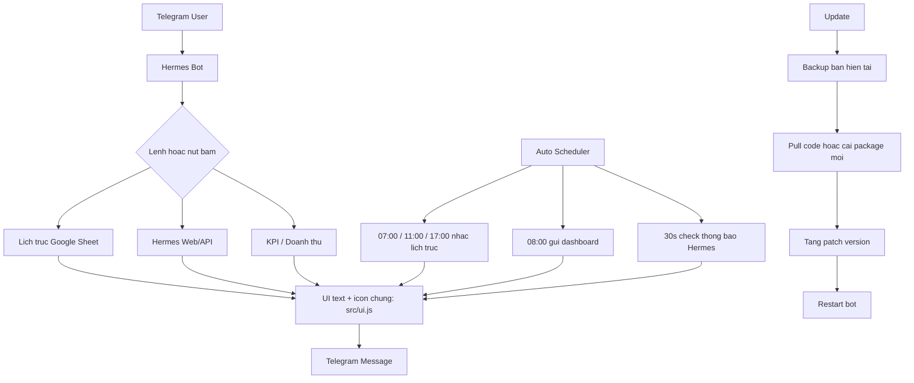

# Hermes Telegram Bot

Bot Telegram cho Hermes: lich lam viec, lich truc, KPI, doanh thu phong, dashboard hang ngay, thong bao phieu moi, backup va version hoa khi update.

## 0. So Do Luong Hoat Dong



## 1. Nguyen Tac UI Text Va Icon

- Text va icon dung chung dat tai `src/ui.js`.
- Icon nam trong `ICON`.
- Chu hien thi nam trong `TEXT`.
- Nut Telegram dung `buttonText()`.
- Trang thai test/thanh cong/loi dung `statusText()`.
- Muon doi font/icon: sua `src/ui.js`, khong sua rai rac trong `src/bot.js`.

## 2. Version Va Backup

Moi lan release/update chinh thuc chay:

```bash
npm run release:local
```

Lenh nay lam 3 viec:

1. Backup code hien tai vao `backups/<timestamp>_v<old>_to_v<new>/`.
2. Tang patch version trong `package.json` va `package-lock.json`.
3. Ghi manifest tai `version-manifest.json`.

Vi du:

```text
1.0.0 -> 1.0.1
```

Backup gom:

- `src/`
- `scripts/`
- `README.md`
- `package.json`
- `package-lock.json`
- `.env.example`
- `data/hermes-users.json.example`

Khong backup file that co secret:

- `.env`
- `data/hermes-users.json`
- token/session/mat khau that

## 3. Cap Nhat Ban Moi

### Cap nhat npm global

```bash
npm i -g hermesbot@latest
```

### Cap nhat VPS tu Git

```bash
npm run update:vps
```

### Cap nhat trong bot

`src/updater.js` xu ly:

1. Kiem tra repo sach.
2. Backup ban hien tai bang `scripts/backup-and-version.js --backup-only`.
3. Pull code moi.
4. Tang patch version bang `scripts/backup-and-version.js`.
5. Chay `npm install` neu `package.json` hoac `package-lock.json` doi.
6. Tra ket qua ve Telegram.


## 4. GitHub Push Va Thong Bao Ban Moi

Repo GitHub dang dung:

```text
https://github.com/trinhduc-lnqt/Ihr_hermes.git
```

Khi co ban moi can dua len GitHub:

```bash
npm run release:local
git status --short
git add hermes_bot
git commit -m "release: hermes bot vX.Y.Z"
git push origin main
```

Kiem tra trang thai:

```bash
npm run github:status
```

Push nhanh neu da commit:

```bash
npm run github:push
```

Bot tu check version GitHub moi moi 30 phut bang `GITHUB_PACKAGE_URL`.
Neu version tren GitHub lon hon version dang chay, bot gui Telegram cho user duoc phep.

Bien `.env` co the cau hinh:

```env
GITHUB_VERSION_CHECK_ENABLED=true
GITHUB_PACKAGE_URL=https://raw.githubusercontent.com/trinhduc-lnqt/Ihr_hermes/main/hermes_bot/package.json
GITHUB_VERSION_CHECK_INTERVAL_MINUTES=30
```

## 5. Update Thu Vien / Dependencies

Cac lenh dung khi can cap nhat thu vien:

```bash
npm run deps:check
npm run deps:update
npm run deps:install
npm run deps:playwright
```

Y nghia:

- `npm run deps:check`: xem thu vien nao co ban moi.
- `npm run deps:update`: update thu vien trong range dang khai bao o `package.json`.
- `npm run deps:install`: cai lai dung theo `package-lock.json` / cap nhat lock khi can.
- `npm run deps:playwright`: cai/cap nhat Chromium cho Playwright.

Sau moi lan pull/update code moi:

1. Neu `package.json` hoac `package-lock.json` doi: chay `npm run deps:install`.
2. Neu Playwright loi browser/chromium: chay `npm run deps:playwright`.
3. Neu muon check ban moi cua thu vien: chay `npm run deps:check`.
4. Neu muon update thu vien trong range an toan: chay `npm run deps:update`.
5. Sau khi update thu vien thanh cong: chay `npm run release:local` de backup va tang version.

Lenh update VPS `npm run update:vps` da tu check `package.json` / `package-lock.json`; neu 2 file nay doi, script se tu chay `npm install`.

## 6. Cai Dat Lan Dau

```bash
cd hermes_bot
npm install
npm run install:browsers
cp .env.example .env
```

Windows co the copy `.env.example` thanh `.env` thu cong.

## 7. Cau Hinh `.env`

Bien bat buoc:

```env
TELEGRAM_BOT_TOKEN=token_bot_hermes
BOT_SECRET_KEY=chuoi_bi_mat_32_64_ky_tu
ALLOWED_TELEGRAM_IDS=telegram_id_duoc_phep
BOT_LOCK_PORT=47831
HERMES_BASE_URL=https://hermes.ipos.vn
HERMES_LOGIN_PATH=/login
```

Ghi chu:

- `BOT_SECRET_KEY`: ma hoa mat khau/session Hermes.
- `ALLOWED_TELEGRAM_IDS`: nhieu ID cach nhau bang dau phay.
- `.env` va `data/hermes-users.json` khong day Git.

## 8. Chay Bot

```bash
npm start
```

Hoac:

```bash
npm run bot
```

Chay PM2:

```bash
pm2 start src/bot.js --name hermes-bot
pm2 save
```

## 9. Lenh Telegram Chinh

- `/start`: mo menu.
- `/today`: dashboard hom nay.
- `/lich`: lich lam viec hom nay.
- `/lich mai`: lich lam viec ngay mai.
- `/lich 28/04/2026`: lich lam viec theo ngay.
- `/truc`: lich truc hom nay.
- `/truc mai`: lich truc ngay mai.
- `/kpi`: KPI thang/nam.
- `/sethermes`: luu/cap nhat tai khoan Hermes.
- `/deletehermes`: xoa tai khoan Hermes.
- `/id`: xem Telegram ID.
- `/cancel`: huy thao tac dang cho.

## 10. Lenh Test An

- `/testtruc`: test thong bao lich truc hom nay.
- `/testtruc mai`: test thong bao lich truc ngay mai.
- `/testauto`: test lich truc + dashboard tu dong, bo qua gio.
- `/testnotify`: test doc thong bao Hermes moi nhat.

## 11. Luong OTP Hermes

- Khong dung auto OTP/n8n/webhook nua.
- Khi Hermes yeu cau OTP, bot giu phien trinh duyet dang cho.
- Nguoi dung nhap OTP truc tiep vao Telegram.
- Bot submit OTP, doi Hermes xac nhan, luu session moi neu thanh cong.

## 12. Lich Truc

Nguon: Google Sheet lich truc.

Tinh nang:

- Xem theo ngay.
- Xem ca tuan.
- Nhac tu dong luc `07:00`, `11:00`, `17:00`.
- Chu nhat co ca 1/ca 2/server rieng.
- Ten nguoi truc format qua `formatDutyInlinePeople()`.
- Lich tuan co header ngay ro: `THU ? DD/MM/YYYY`.

## 13. Dashboard Hang Ngay

Tu gui luc `08:00`.

Noi dung gom:

- Lich truc.
- Lich lam viec Hermes.
- KPI/doanh thu neu co tai khoan Hermes hop le.

## 14. Thong Bao Hermes Moi

Bot check moi `30 giay`.

Co che:

1. Doc thong bao tu Hermes.
2. Tao key tung thong bao.
3. So voi state da gui.
4. Chi gui thong bao moi.
5. Luu key de tranh gui trung.

Neu session Hermes het han, bot danh dau `hermesSessionExpired` va cho nguoi dung dang nhap/OTP lai.

## 15. File Quan Trong

- `src/bot.js`: luong Telegram chinh.
- `src/ui.js`: chu/icon dung chung.
- `src/hermesClient.js`: Playwright + Hermes API.
- `src/store.js`: luu tai khoan/session.
- `src/updater.js`: update tu GitHub.
- `scripts/backup-and-version.js`: backup + tang version.
- `scripts/update-vps.sh`: update VPS/PM2.
- `data/hermes-users.json`: du lieu that, khong commit.

## 16. Quy Trinh Release Khuyen Nghi

```bash
npm run release:local
node -c src/bot.js
node -c src/hermesClient.js
node -c src/ui.js
npm start
```

Neu deploy VPS:

```bash
npm run update:vps
```

Neu dung package global:

```bash
npm i -g hermesbot@latest
```
